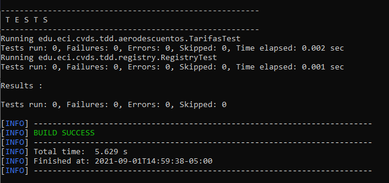

# Lab03

## EJECUTAR LAS PRUEBAS

### Diferencias entre mvn package / mvn test

**mvn package:** Toma el código compilado y lo empaqueta en un formato distribuible como un JAR.

**mvn test:** Corre las pruebas usando una suite de pruebas de un framework de pruebas (En este caso JUnit). Estas pruebas no requieren que el código sea empaquetado o distribuido.

## FINALIZAR EL EJERCICIO

**Casos de equivalencia:**

1. Que la persona que va a votar esté muerta (alive == false) 

2. Que la persona no tenga una edad valida para votar (age < 0)

3. Que la persona ya haya votado antes (votantes.keySet.contains(persona.getID()))

4. Que la persona no tenga edad suficiente para votar (age < 18)
 
5. Que la persona sea valida para votar (Que no se cumpla ninguna de las condiciones anteriores)

## Test

**TarifasTest y RegistryTest**

